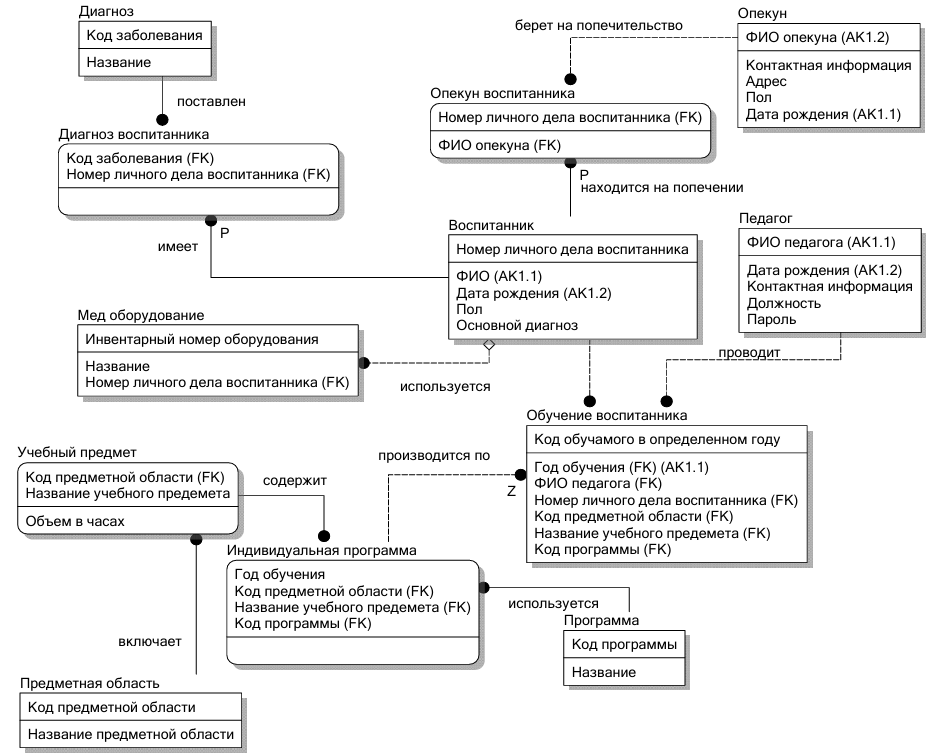
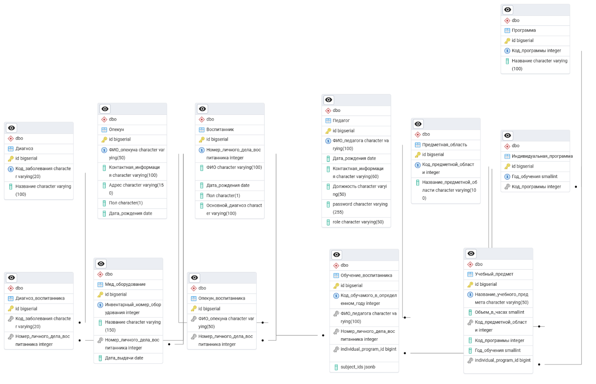
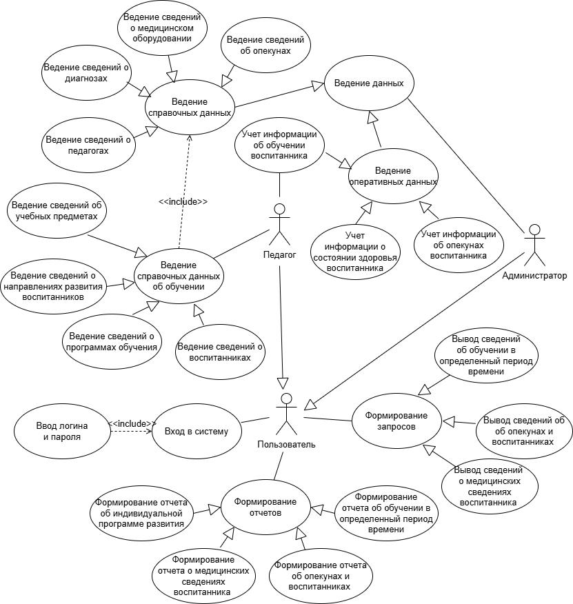
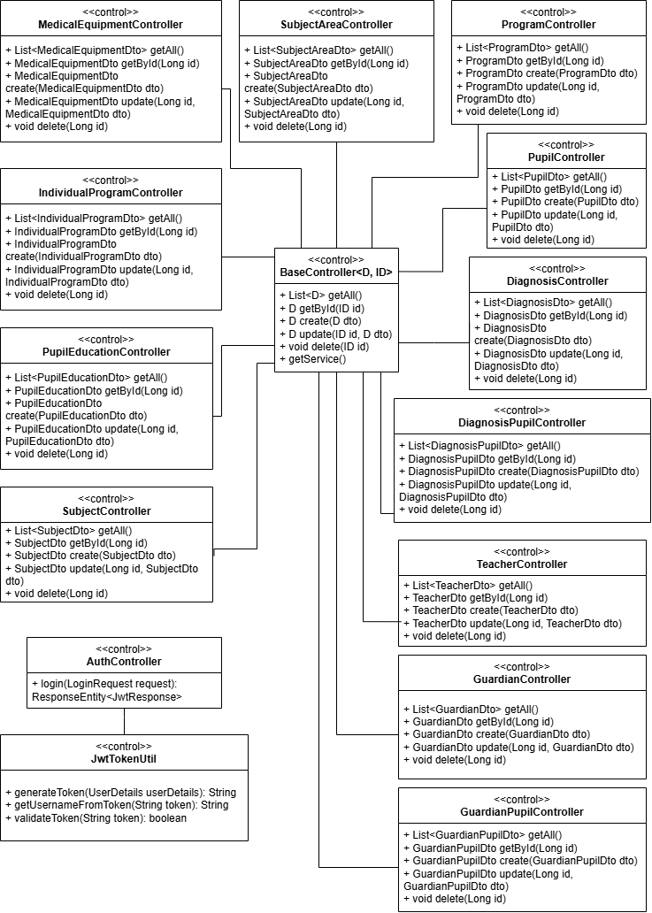
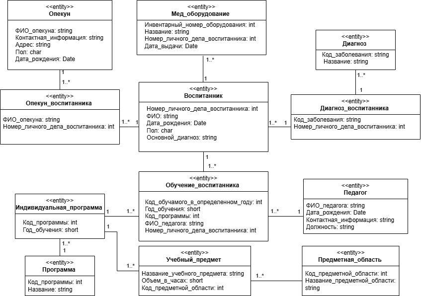

# Автоматизированная информационная система учёта работы отделения психолого-педагогической помощи дома-интерната для детей-инвалидов

Веб-приложение для круглосуточного учёта воспитанников, опекунов, диагнозов, медицинского оборудования, учебных программ и результатов обучения.

## 🛠 Технологии

| Компонент       | Технологии |
|-----------------|------------|
| Бэкенд          | Java 17, Spring Boot, Spring Security, JPA, Maven |
| Фронтенд        | Angular 15+, TypeScript, HTML, CSS |
| База данных     | PostgreSQL, PgAdmin |
| Моделирование   | UML (draw.io), Erwin Data Modeler |
| Среда разработки| IntelliJ IDEA |

## 🛠 Пояснительная записка
В курсовой работе разработана автоматизированная информационная система учёта работы отделения психолого-педагогической помощи дома-интерната для детей-инвалидов. 

Целью курсового проекта является реализация web-приложения дома-интерната для детей-инвалидов – специализированное учреждения, 
предназначенное для круглосуточного проживания, ухода, медицинского обслуживания и социальной адаптации детей с ограниченными возможностями здоровья.
Основная деятельность учреждения охватывает медицинское сопровождение, организацию реабилитационных мероприятий, психолого-педагогическую работу, а также хозяйственное обеспечение.

В рамках выполненной работы был проведен анализ предметной области и существующих систем-аналогов, разработан проект системы по методологии UML с помощью сервиса draw.io, 
разработаны физическая и логическая модели базы данных в среде Erwin Data Modeler r7. Программная реализация серверной части выполнена в среде разработки IntelliJ IDEA 2025.2.3 на языке программирования Java. 
Клиентская часть программы написана на языке программирования TypeScript. База данных реализована под управлением PostgreSQL. 

Рисунок 1 - Схема логической модели базы данных

Рисунок 2 – Схема физической модели базы данных

Физическая модель базы данных реализована в СУБД PgAdmin 4 и включает 12 таблиц. Модель обеспечивает хранение данных о воспитанниках, опекунах, диагнозах, медицинском оборудовании, учебных предметах и программах обучения, а также поддерживает целостность данных за счет механизмов ограничений, индексов и каскадных операций. 

В качестве базовой архитектуры приложения избрана клиент-серверная модель, предполагающая наличие двух основных составляющих: клиентской части, через которую осуществляется взаимодействие с пользователем, и серверной части, на которой выполняются все ресурсоёмкие операции, такие как обработка данных и формирование запросов к базе данных.

В качестве языка реализации серверной части приложения выбран Java, а в качестве основного фреймворка использовался Spring Boot. Для разработки клиентской части был выбран язык TypeScript, в качестве основного клиентского фреймворка используется Angular.

На рисунке 3 изображена диаграмма вариантов использования для разрабатываемой автоматизированной информационной системы.
Данная диаграмма содержит в себе 2 типа актеров: администратор и педагог. 
Каждый из них в зависимости от роли имеет доступ к тем или иным данным системы. Для каждого пользователя обязательна авторизация и, в дальнейшем, аутентификация. Также формировать интересующий для себя запрос может любой пользователь.
Администратор занимается ведением справочных данных, а также оперативных данных, связанных с медицинскими параметрами.
Педагог занимается ведением справочных данных, причастных к обучению воспитанника, а также оперативных данных об обучении.

Рисунок 3 – Диаграмма вариантов использования автоматизированной информационной системы

На рисунке 4 изображена диаграмма управляющих классов разрабатываемой автоматизированной системы, на рисунке 5 – сущностных.

Рисунок 4 – Диаграмма управляющих классов АИС учета работы дома-интерната для детей-инвалидов

Рисунок 5 – Диаграмма сущностных классов 
